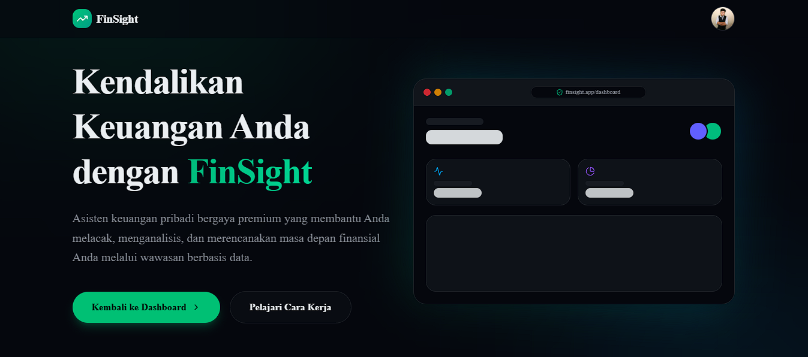
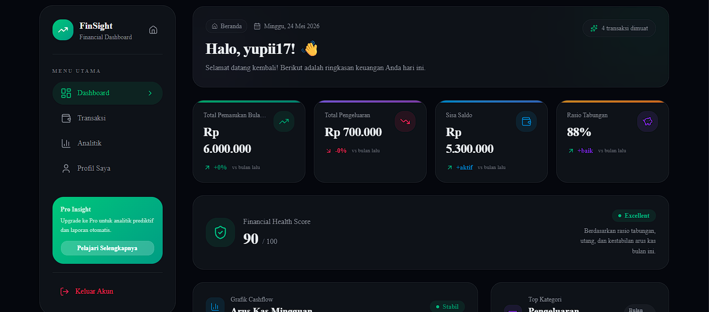
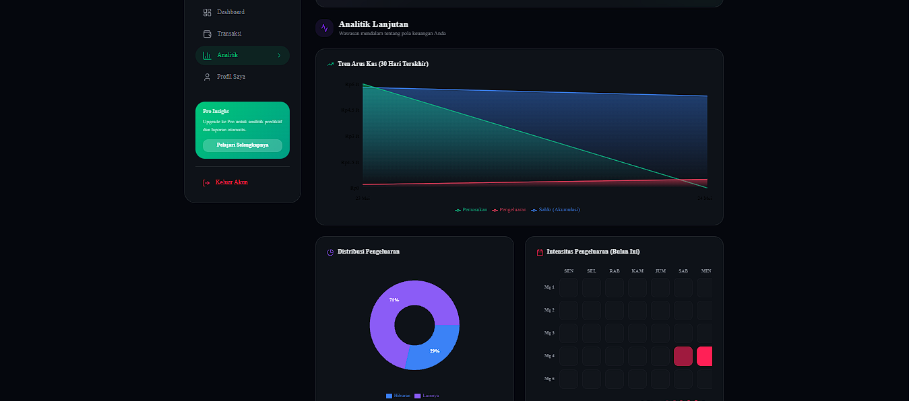

<div align="center">


<br/>


---

### 🚀 Smart Personal Finance Analytics Platform

**FinSight** is a modern fintech-inspired analytics platform that helps users manage, analyze, and improve their financial habits through interactive dashboards, intelligent insights, and real-time analytics.

🔗 **Live Website**  
https://finsight-woad-ten.vercel.app/

</div>

---

# 📌 Overview

FinSight is a modern **fullstack fintech dashboard** combining:

```txt
📊 Financial Analytics
📈 Data Visualization
🧠 Smart Financial Insights
🎯 Goal Tracking
👤 Profile Management
🛡️ Admin Management
🔐 Authentication System
⚡ Realtime Dashboard Experience
```

The platform is designed to transform financial tracking into a smarter, more engaging, and insight-driven experience.

---

# ✨ Features

## 👤 User Dashboard

### 💰 Financial Management
- Income Tracking
- Expense Monitoring
- Saving Analytics
- Budget Planning
- Payment Tracking
- Transaction History
- Monthly Financial Summary

---

### 📊 Financial Analytics
- Cashflow Visualization
- Spending Trend Analysis
- Expense Distribution Chart
- Monthly Financial Comparison
- Savings Ratio Analytics
- Financial Health Score
- Behavior-Based Analytics

---

### 🧠 Smart Financial Insights
Automatically generated insights based on user behavior.

#### Example:
> “Food expenses increased by 24% this month.”

> “Weekend spending is significantly higher than weekdays.”

> “Entertainment spending exceeded budget limits.”

> “Your saving ratio improved compared to last month.”

---

### 🎯 Financial Goal Tracking
Users can:
- Set savings goals
- Monitor progress
- Track financial milestones
- Visualize goal completion

---

### 👤 Profile Management
Users can manage:
- Profile Information
- Avatar
- Financial Personality
- User Preferences
- Security Settings
- Personalized Dashboard View

#### Personality Examples
```txt
💎 Smart Saver
📈 Strategic Planner
🔥 Budget Master
💸 Impulsive Buyer
🧠 Financial Explorer
```

---

## 🛡️ Admin Dashboard

Admin dashboard allows platform monitoring and management.

### Admin Features
- User Management
- Platform Analytics
- Financial Behavior Monitoring
- Activity Logs
- Transaction Monitoring
- Announcement Management
- Risk Monitoring Dashboard
- Role-Based Access Control

### 📊 Admin Analytics
Admin can monitor:

```txt
👥 Total Users
💰 Total Transactions
📈 User Growth
🔥 Active Users
🧠 Financial Behaviors
🚨 Risk Detection
📢 System Announcements
```

---

# 🖼️ Dashboard Preview

> Visual sections of the application:

### 📸 Landing Page


### 📸 User Dashboard & Insights


### 📸 Financial Analytics


### 📸 Admin Dashboard


---

# 🛠 Tech Stack

| Technology | Description |
|---|---|
| Next.js | Frontend Framework |
| Tailwind CSS | Styling |
| shadcn/ui | Modern Components |
| Supabase | Backend & Authentication |
| PostgreSQL | Database |
| Recharts | Analytics Visualization |
| Lucide React | Icons |
| Vercel | Deployment |

---

# 🧩 Database Architecture

### Main Tables

| Table | Description |
|---|---|
| users | User data |
| profiles | Profile system |
| transactions | Financial transactions |
| categories | Financial categories |
| budgets | Budget management |
| goals | Financial goals |
| insights | Smart insights |
| financial_scores | Financial scoring |
| activity_logs | User activities |
| announcements | Admin announcements |
| achievements | Progress badges |
| user_achievements | User badge mapping |

---

# 📁 Project Structure

```bash
finsight/
│
├── app/
│   ├── dashboard/
│   ├── admin/
│   ├── profile/
│   ├── analytics/
│   └── authentication/
│
├── components/
├── hooks/
├── lib/
├── services/
├── public/
├── styles/
└── .env.local
```

---

# 🚀 Installation

## Clone Repository

```bash
git clone https://github.com/Yunaaaa13/finsight.git
```

---

## Open Project

```bash
cd finsight
```

---

## Install Dependencies

```bash
npm install
```

---

## Setup Environment Variables

Create `.env.local`

```env
NEXT_PUBLIC_SUPABASE_URL=your_supabase_url
NEXT_PUBLIC_SUPABASE_ANON_KEY=your_supabase_anon_key
```

---

## Run Development Server

```bash
npm run dev
```

Open:

```bash
http://localhost:3000
```

---

# 🌐 Deployment

FinSight is deployed using:

- ▲ Vercel
- ⚡ Supabase

---

# 🎯 Project Goals

This project was built to:

- Practice Fullstack Development
- Learn Financial Analytics Systems
- Improve Data Visualization Skills
- Explore Business Intelligence Concepts
- Create Production-Ready Portfolio Projects
- Design Modern SaaS Interfaces
- Build a Fintech-Inspired Product Experience

---

# 🔮 Future Roadmap

### Planned Features

- 🤖 AI Financial Assistant
- 📄 PDF Financial Reports
- 📷 OCR Receipt Scanner
- 🔔 Realtime Notifications
- 🌍 Multi Currency Support
- 📊 Predictive Analytics
- 🏆 Achievement System
- 📱 Mobile Optimization
- 📎 User Export/Import Data
- 🧠 Advanced Financial Personality Analysis

---

# 📈 Repository Activity

<div align="center">


</div>

---

# 🚀 Project Status

<div align="center">

| Module | Status |
|---|---:|
| Landing Page | ✅ Completed |
| Authentication | ✅ Completed |
| User Dashboard | ✅ Completed |
| Financial Analytics | ✅ Completed |
| Profile System | ✅ Completed |
| Admin Dashboard | ✅ Completed |
| AI Financial Insight | 🚧 In Progress |
| OCR Receipt Scanner | 📌 Planned |
| Predictive Analytics | 📌 Planned |

</div>

---

# 📈 FinSight Metrics

<div align="center">


</div>

---

# 🚀 Product Highlights

<div align="center">

| 💰 Finance | 📊 Analytics | 🧠 Intelligence | 🛡️ Admin |
|---|---|---|---|
| Expense Tracking | Financial Dashboard | Smart Insights | User Management |
| Savings Monitoring | Trend Visualization | Personality Analysis | Risk Monitoring |
| Goal Tracking | Cashflow Analytics | Financial Health Score | Activity Logs |

</div>

---

# 👨‍💻 Developer

<div align="center">


### Fullstack Developer • Data Analytics Enthusiast • Fintech Builder

Built with ❤️ using:


---

### 💡 Current Focus

```txt
📊 Financial Analytics
🧠 Data Visualization
⚡ SaaS Dashboard Development
💸 Fintech Product Engineering
```

---

### 🌍 Connect With Me

<a href="https://github.com/Yunaaaa13">

</a>

---

### ⭐ If you like this project, don't forget to star the repository!


</div>
